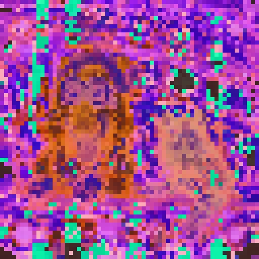
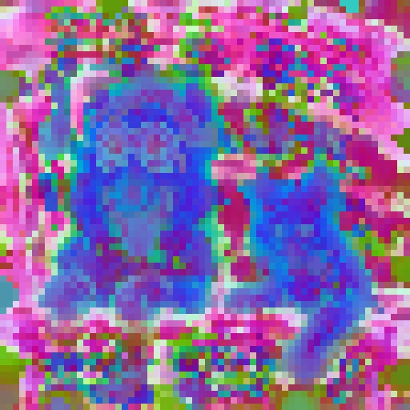
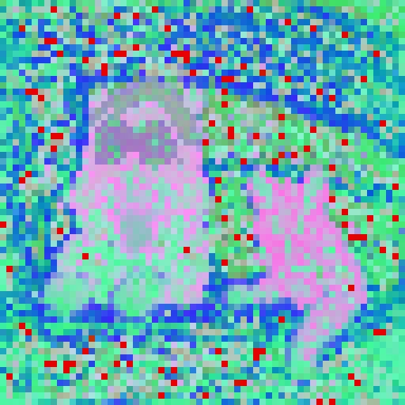

# UniRefiner Fork: SAM3, DINOv3, and Shift Consistency Loss

This repository is based on **UniRefiner: Teaching Pre-trained ViTs to Self-Dispose Dross via Contrastive Register**.

Original UniRefiner materials: [[Upstream README](https://github.com/congpeiqiu/UniRefiner#readme)] [[Project Page](https://congpeiqiu.github.io/UniRefiner/)] [[Paper](https://arxiv.org/abs/2605.19622)] [[PDF](https://arxiv.org/pdf/2605.19622)] [[BibTeX](#citation)]

## What Changed in This Fork

This fork keeps the original UniRefiner training pipeline and adds support for newer backbones and an extra consistency regularizer:

- **SAM3 support**: added `unirefiner.models.wrappers.sam3`, registry wiring, and recipes in [configs/sam3.yaml](configs/sam3.yaml) and [configs/sam3_pro.yaml](configs/sam3_pro.yaml). The wrapper builds the SAM3 vision trunk, loads detector checkpoints, exposes dense patch tokens, and registers attention hooks.
- **DINOv3 support**: added `unirefiner.models.wrappers.dinov3`, registry auto-detection, and recipes in [configs/dinov3.yaml](configs/dinov3.yaml) and [configs/dinov3_pro.yaml](configs/dinov3_pro.yaml). The recipe uses the timm model id `vit_large_patch16_dinov3_qkvb.sat493m-timm`.
- **Shift consistency loss**: added a window-phase shift consistency regularizer in [unirefiner/method/losses.py](unirefiner/method/losses.py). It shifts images by patch-aligned offsets without wraparound and penalizes dense-token cosine distance on the valid overlapping region.
- **Training switches**: added `method.enable_window_phase_artifact_loss` for the new loss and `model.grad_checkpointing` for student models that expose `set_grad_checkpointing`.
- **Ready-to-run pro recipes**: `*_pro.yaml` enables the shift consistency loss for SAM3/DINOv3, and `dinov3_pro.yaml` also enables gradient checkpointing.
- **Local output hygiene**: `sam3/` and `output*` are ignored so local SAM3 checkouts, checkpoints, and training outputs are not committed by accident.

## Introduction

UniRefiner is a one-for-all refinement framework for ViT foundation models across architectures and scales. It improves dense spatial representations by teaching pre-trained ViTs to redirect spurious tokens into contrastive registers. Please see the [project page](https://congpeiqiu.github.io/UniRefiner/) for the full method description and visual analysis.

| BAAI EVA-CLIP-8B-448 | Google SigLIP2-So400M | DeepGlint RICE-ViT-Large |
|:---:|:---:|:---:|
|  |  |  |

## Installation

The original UniRefiner installation flow is still used. For the upstream instructions and background, see the [original README](https://github.com/congpeiqiu/UniRefiner#readme).

We recommend using `uv` through the provided setup helper:

```bash
bash tools/setup_uv_env.sh
source .venv/bin/activate
```

Or install manually:

```bash
pip install uv
uv venv .venv --python 3.10
source .venv/bin/activate
uv pip install --index-url https://download.pytorch.org/whl/cu124 torch==2.6.0 torchvision==0.21.0
uv pip install -e ".[dev]"
```

### Optional SAM3 Setup

SAM3 is optional. To run the SAM3 recipes, make sure the `sam3` Python package is importable, or place a local SAM3 checkout at `./sam3`. The local `sam3/` directory is intentionally ignored by git.

The checked-in SAM3 configs contain a local checkpoint path for the author's machine. Override it when training:

```bash
--override model.name=/path/to/sam3.pt
```

### Optional DINOv3 Setup

DINOv3 recipes use the timm model id `vit_large_patch16_dinov3_qkvb.sat493m-timm` with `model.wrapper=dinov3`. If your environment uses a local checkpoint or mirror, override `model.name` in the same way as other UniRefiner recipes.

The checked-in `*_pro.yaml` files contain local example dataset paths. Replace `data.train_image_root` with your own image folders before training.

## Data Preparation

UniRefiner training only needs an image folder. Images are loaded recursively; annotations are not required.

```text
UniRefiner/
├── data/
│   └── train_images/
│       ├── image_000001.jpg
│       ├── image_000002.png
│       └── subfolder/
│           └── image_000003.webp
└── assets/
    └── backgrounds/
        └── fixed_reference.png
```

Supported image extensions are `.jpg`, `.jpeg`, `.png`, `.bmp`, and `.webp`. 

## Run

Running UniRefiner with 4 GPUs for `google/siglip2-so400m-patch16-512`:

```bash
PYTHONPATH=$PWD \
torchrun --nproc_per_node=4 -m unirefiner.cli.train \
  --config configs/siglip2_so400m.yaml \
  --override data.train_image_root=/path/to/train_images \
  --override experiment.output_dir=outputs/siglip2_so400m \
  --override logging.wandb=true \
  --override logging.wandb_mode=online \
  --override logging.wandb_project=UniRefiner \
  --override logging.wandb_run_name=siglip2_so400m \
  --override diagnostics.vis_pca_interval=100
```

Backbones are loaded through Hugging Face `transformers` by default. The project supports ViT-style foundation models when a wrapper exposes the minimal UniRefiner interface:

- `encode_dense(images)`: returns dense raster-order patch tokens with shape `[B, N, C]`.
- `patch_size`: patch size used to map image resolution to token grids.
- `image_mean` and `image_std`: preprocessing statistics.
- `hook_prepare(...)`: optional; only needed when attention hijacker-hijackee filtering is enabled.

Built-in wrappers cover the recipes listed below. Custom wrappers can be passed through `model.wrapper` as `module.path:object`.

The default recipes use official Hugging Face model IDs. Local checkpoints or mirrors can be used by overriding `model.name`.

### New Recipes in This Fork

Run DINOv3:

```bash
PYTHONPATH=$PWD \
torchrun --nproc_per_node=4 -m unirefiner.cli.train \
  --config configs/dinov3.yaml \
  --override data.train_image_root=/path/to/train_images \
  --override experiment.output_dir=outputs/dinov3
```

Run DINOv3 with shift consistency loss:

```bash
PYTHONPATH=$PWD \
torchrun --nproc_per_node=4 -m unirefiner.cli.train \
  --config configs/dinov3_pro.yaml \
  --override data.train_image_root=/path/to/train_images \
  --override experiment.output_dir=outputs/dinov3_pro
```

Run SAM3:

```bash
PYTHONPATH=$PWD \
torchrun --nproc_per_node=4 -m unirefiner.cli.train \
  --config configs/sam3.yaml \
  --override model.name=/path/to/sam3.pt \
  --override data.train_image_root=/path/to/train_images \
  --override experiment.output_dir=outputs/sam3
```

Run SAM3 with shift consistency loss:

```bash
PYTHONPATH=$PWD \
torchrun --nproc_per_node=4 -m unirefiner.cli.train \
  --config configs/sam3_pro.yaml \
  --override model.name=/path/to/sam3.pt \
  --override data.train_image_root=/path/to/train_images \
  --override experiment.output_dir=outputs/sam3_pro
```

## Shift Consistency Loss

The shift consistency loss is implemented as `compute_window_phase_artifact_loss`. It detects the model's local window size, creates quarter-window and half-window patch shifts, re-encodes shifted images without wraparound, aligns the valid overlapping token grids, and minimizes cosine distance between original and shifted dense tokens.

It is currently enabled only for SAM3 and DINOv3 wrappers. To enable it in another compatible config, set:

```bash
--override method.enable_window_phase_artifact_loss=true
```

During training this term is logged as `loss_wpa`.

## Training

| # | Backbone | Hugging Face model | Recipe | Checkpoint |
|:---:|:---|:---|:---|:---:|
| 1 | BAAI EVA-CLIP-8B-448 | `BAAI/EVA-CLIP-8B-448` | [configs/evaclip8b.yaml](configs/evaclip8b.yaml) | TBA |
| 2 | OpenGVLab InternViT-6B-224px | `OpenGVLab/InternViT-6B-224px` | [configs/internvit_6b_224px.yaml](configs/internvit_6b_224px.yaml) | TBA |
| 3 | LAION CLIP ViT-g/14, laion2B-s12B-b42K | `laion/CLIP-ViT-g-14-laion2B-s12B-b42K` | [configs/laion_clip_giant.yaml](configs/laion_clip_giant.yaml) | TBA |
| 4 | Meta DINOv2 ViT-g/14 | `facebook/dinov2-giant` | [configs/dinov2_giant.yaml](configs/dinov2_giant.yaml) | TBA |
| 5 | Google SigLIP2-So400M, patch16-512 | `google/siglip2-so400m-patch16-512` | [configs/siglip2_so400m.yaml](configs/siglip2_so400m.yaml) | TBA |
| 6 | Google SigLIP2-Giant-OPT, patch16-384 | `google/siglip2-giant-opt-patch16-384` | [configs/siglip2_giant_384.yaml](configs/siglip2_giant_384.yaml) | TBA |
| 7 | DeepGlint RICE-ViT-Large, patch14-560 | `DeepGlint-AI/rice-vit-large-patch14-560` | [configs/rice_vit_large_560.yaml](configs/rice_vit_large_560.yaml) | TBA |
| 8 | DINOv3 ViT-L/16 | `vit_large_patch16_dinov3_qkvb.sat493m-timm` | [configs/dinov3.yaml](configs/dinov3.yaml) | TBA |
| 9 | DINOv3 ViT-L/16 + shift consistency | `vit_large_patch16_dinov3_qkvb.sat493m-timm` | [configs/dinov3_pro.yaml](configs/dinov3_pro.yaml) | TBA |
| 10 | SAM3 vision trunk | local SAM3 checkpoint | [configs/sam3.yaml](configs/sam3.yaml) | TBA |
| 11 | SAM3 vision trunk + shift consistency | local SAM3 checkpoint | [configs/sam3_pro.yaml](configs/sam3_pro.yaml) | TBA |


## License

This project is licensed under the [Apache License 2.0](LICENSE). 

## Citation

```bibtex
@article{qiu2026unirefiner,
  title={UniRefiner: Teaching Pre-trained ViTs to Self-Dispose Dross via Contrastive Register},
  author={Qiu, Congpei and Hu, Zhaoyu and Ke, Wei and Tian, Zhuotao and Wu, Yanhao and Zhang, Tong},
  journal={arXiv preprint arXiv:2605.19622},
  year={2026},
  eprint={2605.19622},
  archivePrefix={arXiv},
  primaryClass={cs.CV},
  url={https://arxiv.org/abs/2605.19622}
}
```
